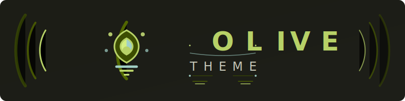
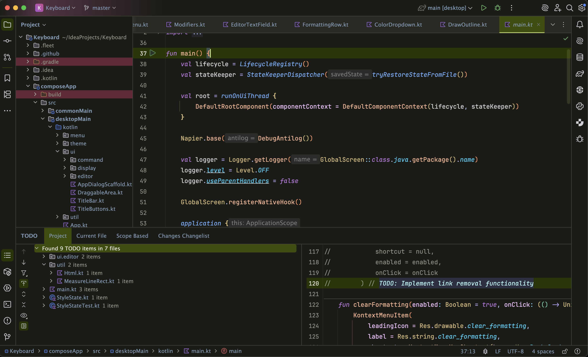

  

---

<!-- Plugin description -->

[//]: # (  <!-- Release version -->)

[//]: # (  <a href="https://plugins.jetbrains.com/plugin/16142-nightfall-theme">)

[//]: # (    )

[//]: # (  </a>)

[//]: # (  <!-- Downloads -->)

[//]: # (  <a href="https://plugins.jetbrains.com/plugin/16142-nightfall-theme">)

[//]: # (    )

[//]: # (  </a>)

[//]: # (  <!-- Rating -->)

[//]: # (  <a href="https://plugins.jetbrains.com/plugin/16142-nightfall-theme">)

[//]: # (    )

[//]: # (  </a>)

A dark theme for IntelliJ IDEA inspired by olives 🍸

  

<!-- Plugin description end -->

## Installation

- Using the IDE built-in plugin system:

  <kbd>Settings/Preferences</kbd> > <kbd>Plugins</kbd> > <kbd>Marketplace</kbd> > <kbd>Search for "Olive Theme"</kbd> >
  <kbd>Install</kbd>

- Manually:

[//]: # (  Download the [latest release]&#40;https://github.com/coeiico/jetbrains-nightfall-theme/releases/latest&#41; and install it manually using)
  <kbd>Settings/Preferences</kbd> > <kbd>Plugins</kbd> > <kbd>⚙️</kbd> > <kbd>Install plugin from disk...</kbd>

## Screenshots

[//]: # (
)

[//]: # (  )

[//]: # (
)

[//]: # ()
[//]: # (
)

[//]: # (  )

[//]: # (
)

[//]: # (
)

[//]: # (  )

[//]: # (
)

[//]: # ()
[//]: # (
)

[//]: # (  )

[//]: # (
)

<!-- markdownlint-restore -->
<!-- prettier-ignore-end -->

<!-- ALL-CONTRIBUTORS-LIST:END -->

<!-- This project follows the [all-contributors](https://github.com/all-contributors/all-contributors) specification. Contributions of any kind welcome! -->

---

  <!-- license -->

[//]: # (  <a href="https://github.com/brandii-co/jetbrains-nightfall-theme/blob/main/LICENSE">)

[//]: # (   )

[//]: # (  </a>)

